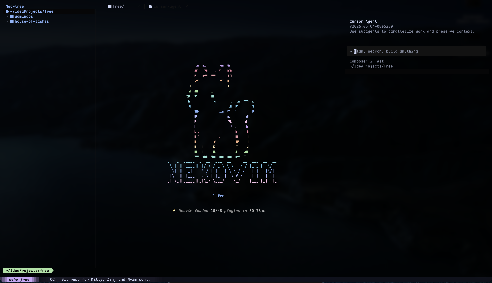

<p align="center">
  
</p>

<p align="center">
  
</p>

<h1 align="center">neko</h1>

<p align="center">
  Personal dotfiles for <strong>Kitty</strong>, <strong>Neovim</strong> (LazyVim), and <strong>Zsh</strong>
</p>

---

| Config | Description |
|---|---|
| [kitty/](kitty/) | Kitty terminal — Catppuccin Mocha theme, IDE-style split keybindings, macOS blur |
| [nvim/](nvim/) | Neovim (LazyVim) — Catppuccin Mocha transparent, multi-language LSP, custom dashboard |
| [zsh/](zsh/) | Zsh (Oh My Zsh) — Starship prompt, Catppuccin syntax highlighting, dev toolchains |

## Getting Started

1. Install [Maple Mono Nerd Font](https://github.com/subframe7536/maple-font/releases) — see [kitty/README.md](kitty/README.md#font) for instructions
2. Copy or symlink the configs to your home directory:

   ```bash
   # Kitty
   ln -sf ~/neko/kitty/kitty.conf ~/.config/kitty/kitty.conf
   ln -sf ~/neko/kitty/catppuccin-mocha.conf ~/.config/kitty/catppuccin-mocha.conf

   # Neovim
   ln -sf ~/neko/nvim/init.lua ~/.config/nvim/init.lua
   ln -sf ~/neko/nvim/lazy-lock.json ~/.config/nvim/lazy-lock.json
   ln -sf ~/neko/nvim/lazyvim.json ~/.config/nvim/lazyvim.json
   ln -sf ~/neko/nvim/stylua.toml ~/.config/nvim/stylua.toml
   ln -sf ~/neko/nvim/.neoconf.json ~/.config/nvim/.neoconf.json
   ln -sf ~/neko/nvim/.gitignore ~/.config/nvim/.gitignore
   ln -sf ~/neko/nvim/LICENSE ~/.config/nvim/LICENSE
   ln -sf ~/neko/nvim/lua ~/.config/nvim/lua
   ln -sf ~/neko/nvim/scripts ~/.config/nvim/scripts

   # Zsh
   ln -sf ~/neko/zsh/.zshrc ~/.zshrc
   ```
3. Open Kitty and Neovim — plugins will auto-install

## Syncing

The repo is a snapshot — `~/.config/` is the source of truth. After making changes there, sync back to the repo:

```bash
./sync.sh
```

Then commit and push.

## Structure

```
neko/
├── assets/
│   ├── neko.png
│   └── preview.png
├── README.md
├── sync.sh
├── kitty/
│   ├── README.md
│   ├── kitty.conf
│   └── catppuccin-mocha.conf
├── nvim/
│   ├── README.md
│   ├── init.lua
│   ├── lazy-lock.json
│   ├── lazyvim.json
│   ├── stylua.toml
│   ├── .neoconf.json
│   ├── .gitignore
│   ├── LICENSE
│   ├── lua/
│   └── scripts/
└── zsh/
    ├── README.md
    └── .zshrc
```
